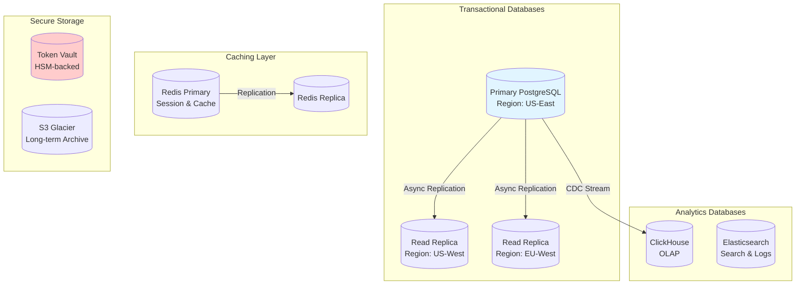

## Data Storage Layer

### Database Architecture

#### PostgreSQL Configuration
- **Version:** PostgreSQL 15+

**Schema Design:**
- `transactions` table (partitioned by date)
- `customers` table
- `merchants` table
- `payment_methods` table (tokenized)
- `settlements` table
- `chargebacks` table

**Indexing Strategy:**
- B-tree indexes on `transaction_id`, `customer_id`, `merchant_id`
- GIN indexes for JSONB fields
- Partial indexes for frequently queried subsets

**Performance Tuning:**
- Shared buffers: 25% of RAM
- Work memory: 50MB per connection
- Effective cache size: 75% of RAM
- Max connections: 500 (with PgBouncer connection pooling)

**Backup Strategy:**
- Continuous archiving (WAL)
- Daily full backups
- Point-in-time recovery (PITR)
- Cross-region backup replication
- Retention: 30 days

 

### Redis Cache

**Use Cases:**
- Session management
- Token caching
- Fraud detection feature cache
- Rate limiting counters
- Real-time analytics counters

**Data Structures:**
- Strings (session tokens)
- Hashes (user profiles)
- Sets (blocked IPs)
- Sorted Sets (leaderboards)
- HyperLogLog (unique visitor counts)

- **Eviction Policy:** LRU (Least Recently Used)
- **Persistence:** RDB snapshots + AOF (Append-Only File)

### Data Retention

| Data Type            | Retention Period                  | Storage                    |
|---------------------|-----------------------------------|----------------------------|
| Transaction details | 7 years                           | PostgreSQL + S3 Glacier    |
| Card tokens         | Until card expires + 1 year       | HSM Vault                  |
| Fraud logs          | 5 years                           | Elasticsearch              |
| Analytics data      | 3 years                           | ClickHouse                 |
| Audit logs          | 10 years                          | S3 Glacier                 |
| Session data        | 24 hours                          | Redis                      |

 

## Security & Compliance

### PCI DSS v4.0 Compliance

**Requirements Addressed:**

#### Build and Maintain Secure Network
- Firewall configuration (WAF, network segmentation)
- No default passwords
- Encrypted VPN for remote access

#### Protect Cardholder Data
- Tokenization (no PAN storage)
- Encryption at rest (AES-256)
- Encryption in transit (TLS 1.3)

#### Maintain Vulnerability Management Program
- Quarterly vulnerability scans (Qualys)
- Annual penetration testing
- Dependency scanning (Snyk, Dependabot)

#### Implement Strong Access Control
- Role-based access control (RBAC)
- Multi-factor authentication (MFA)
- Least privilege principle

#### Regularly Monitor and Test Networks
- SIEM (Security Information and Event Management)
- Intrusion detection (IDS/IPS)
- Log aggregation (ELK stack)

#### Maintain Information Security Policy
- Security awareness training
- Incident response plan
- Business continuity plan

**PCI DSS Scope Reduction:**
- Tokenization reduces CDE (Cardholder Data Environment) scope
- Hosted checkout pages (PCI Level 1 compliant)
- Network segmentation isolates CDE

 

### Encryption Standards

**At Rest:**
- AES-256 encryption for all databases
- Encrypted EBS volumes (AWS)
- Hardware Security Modules (HSM) for key management

**In Transit:**
- TLS 1.3 (minimum TLS 1.2)
- Perfect Forward Secrecy (PFS)
- Certificate pinning for mobile apps

**Key Management:**
- AWS KMS (Key Management Service)
- Key rotation every 90 days
- Separate keys per environment (dev, staging, prod)

 

## Regulatory Compliance

### PSD2 (Payment Services Directive 2)
- Strong Customer Authentication (SCA)
- 3D Secure 2.0 implementation
- API access for third-party providers (TPPs)

### GDPR (General Data Protection Regulation)
- Data encryption
- Right to erasure (user data deletion)
- Data portability
- Consent management
- Privacy by design

### SOC 2 Type II
- Security controls
- Availability (99.99% uptime)
- Processing integrity
- Confidentiality
- Privacy

### Other Regulations
- CCPA (California Consumer Privacy Act)
- KYC/AML (Know Your Customer / Anti-Money Laundering)
- OFAC (Office of Foreign Assets Control) sanctions screening

