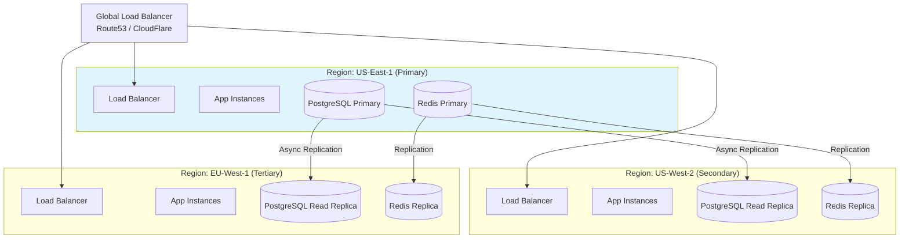

 

## Failover Strategy

- **Automatic Health Checks**: Every 30 seconds  
- **DNS Failover**: Route53 health-based routing (TTL: 60s)  
- **Database Promotion**: Automatic read replica promotion  
- **RTO (Recovery Time Objective)**: < 5 minutes  
- **RPO (Recovery Point Objective)**: < 1 minute  

 

## Backup Strategy

### Database Backups

- Continuous WAL archiving to S3  
- Daily full backups (automated)  
- Retention: 30 days online, 7 years in Glacier  

### Application Backups

- Infrastructure as Code (Terraform state in S3)  
- Docker images in ECR (versioned)  
- Configuration in Git (version controlled)  

 

## Testing

- Quarterly disaster recovery drills  
- Automated backup restoration tests  
- Chaos engineering (random instance termination)  
