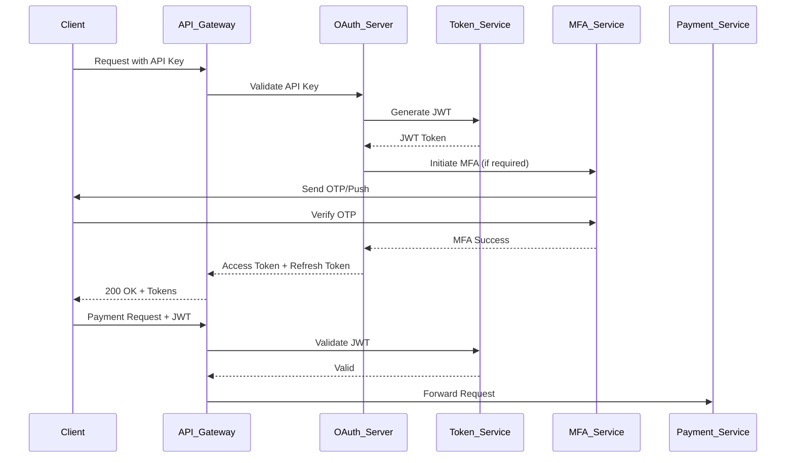

```mermaid
sequenceDiagram
    participant Client
    participant API_Gateway
    participant OAuth_Server
    participant Token_Service
    participant MFA_Service
    participant Payment_Service

    Client->>API_Gateway: Request with API Key
    API_Gateway->>OAuth_Server: Validate API Key
    OAuth_Server->>Token_Service: Generate JWT
    Token_Service-->>OAuth_Server: JWT Token
    OAuth_Server->>MFA_Service: Initiate MFA (if required)
    MFA_Service->>Client: Send OTP/Push
    Client->>MFA_Service: Verify OTP
    MFA_Service-->>OAuth_Server: MFA Success
    OAuth_Server-->>API_Gateway: Access Token + Refresh Token
    API_Gateway-->>Client: 200 OK + Tokens
    Client->>API_Gateway: Payment Request + JWT
    API_Gateway->>Token_Service: Validate JWT
    Token_Service-->>API_Gateway: Valid
    API_Gateway->>Payment_Service: Forward Request


```
