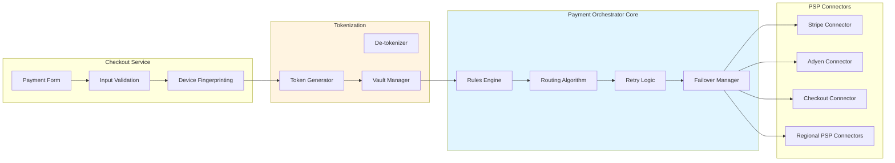

```mermaid
graph LR
    subgraph CS ["Checkout Service"]
        FORM[Payment Form]
        VALIDATION[Input Validation]
        DEVICE_FP[Device Fingerprinting]
    end

    subgraph POC ["Payment Orchestrator Core"]
        RULE_ENGINE[Rules Engine]
        ROUTING_ALGO[Routing Algorithm]
        RETRY_LOGIC[Retry Logic]
        FAILOVER[Failover Manager]
    end

    subgraph TOK ["Tokenization"]
        TOKENIZER[Token Generator]
        DETOKENIZER[De-tokenizer]
        VAULT_MGR[Vault Manager]
    end

    subgraph PSP ["PSP Connectors"]
        STRIPE_CONN[Stripe Connector]
        ADYEN_CONN[Adyen Connector]
        CHECKOUT_CONN[Checkout Connector]
        REGIONAL_CONN[Regional PSP Connectors]
    end

    FORM --> VALIDATION
    VALIDATION --> DEVICE_FP
    DEVICE_FP --> TOKENIZER
    TOKENIZER --> VAULT_MGR
    VAULT_MGR --> RULE_ENGINE
    
    RULE_ENGINE --> ROUTING_ALGO
    ROUTING_ALGO --> RETRY_LOGIC
    RETRY_LOGIC --> FAILOVER
    
    FAILOVER --> STRIPE_CONN
    FAILOVER --> ADYEN_CONN
    FAILOVER --> CHECKOUT_CONN
    FAILOVER --> REGIONAL_CONN

    style POC fill:#e1f5ff
    style TOK fill:#fff4e1


```
