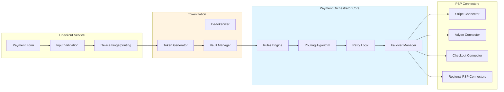
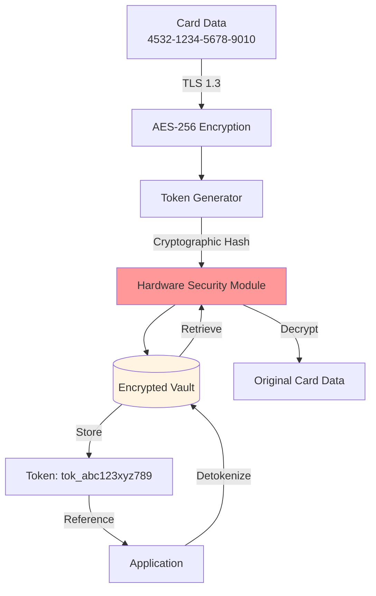

## Architecture Principles

The **Payment Orchestration Layer** is the intelligent control center that:

- Abstracts complexity of multiple PSPs  
- Implements smart routing logic  
- Manages tokenization & PCI compliance  
- Handles failover & retries  
- Optimizes authorization rates

 

 

## Checkout Service

### Hosted Checkout

- PCI DSS Level 1 compliant hosted page  
- Customizable UI (white-label)  
- Supports 50+ payment methods  
- Mobile-responsive design  
- Accessibility (WCAG 2.1 AA)  

### Embedded SDK

- Drop-in components (React, Vue, Angular)  
- Iframe isolation for sensitive data  
- Client-side encryption  
- Real-time validation  

### Features

- Auto-detect user region/language  
- Currency conversion  
- Saved payment methods  
- One-click checkout

## Intelligent Router

### Routing Strategies

#### Cost Optimization

- Route to lowest-cost PSP per transaction type  
- Consider interchange fees + processing fees  
- Dynamic fee calculation  

#### Success Rate Optimization

- ML-based routing to PSP with highest approval rate  
- Factors: card BIN, issuer, geography, amount  
- Real-time success rate monitoring  

#### Geographic Routing

- Route to local acquirers for better approval  
- Comply with local regulations  
- Reduce cross-border fees  

#### Load Balancing

- Distribute load across PSPs  
- Prevent single PSP throttling  
- Round-robin or weighted distribution  

#### Failover Routing

- Cascade to backup PSP on failure  
- Circuit breaker pattern (3 failures = circuit open)  
- Automatic recovery testing  

 

<pre>
    
IF (transaction.amount > 1000 && transaction.currency == "EUR") 
   THEN route_to("Adyen")
ELSE IF (transaction.country == "US" && card.type == "AMEX")
   THEN route_to("Stripe")
ELSE IF (fraud_score > 0.7)
   THEN route_to("ManualReview")
ELSE
   route_to_cheapest_with_success_rate(min_rate=0.95)

</pre>
 

## Token Vault

### PCI DSS Tokenization

- Replace PAN (Primary Account Number) with non-reversible token  
- Format-preserving tokens (maintain card type/last 4 digits)  
- Multi-domain tokenization (web, mobile, POS use different tokens)  
- Token lifecycle management
  

 

### Security Features

- Hardware Security Module (HSM) for key management  
- Key rotation every 90 days  
- Separate encryption keys per environment  
- No mathematical reversibility  
- Audit logging of all token operations  

### Token Types

- Single-use tokens (for checkout)  
- Multi-use tokens (for subscriptions)  
- Network tokens (Visa/Mastercard tokenization)  
