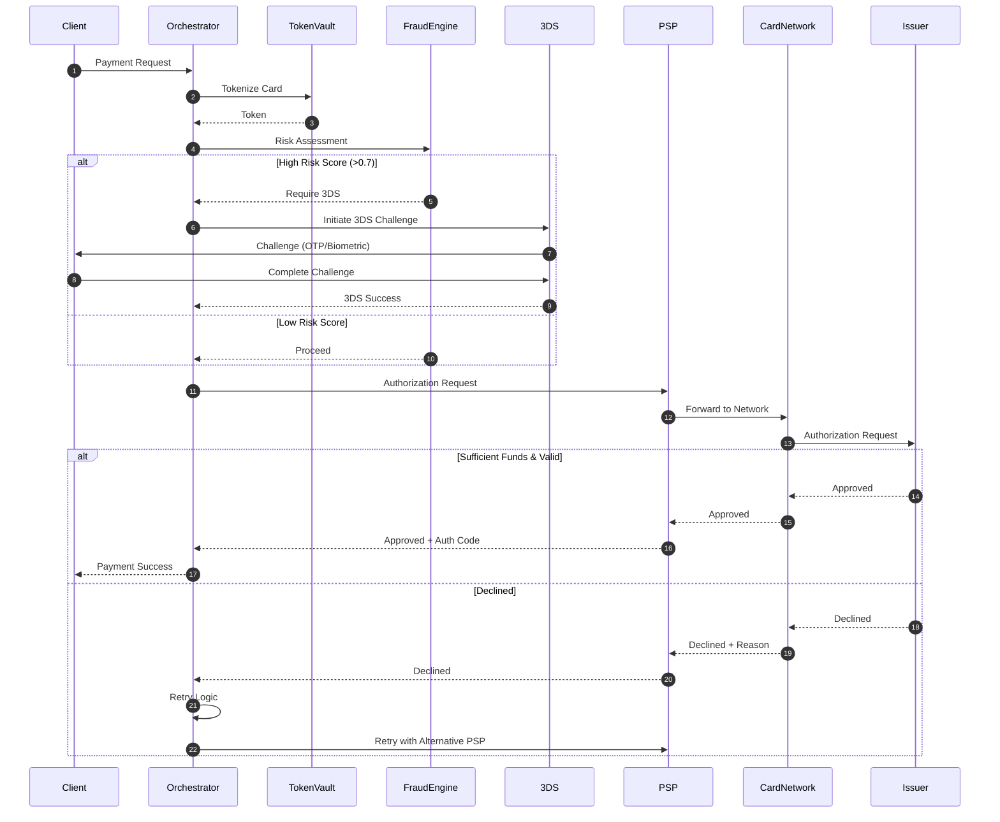

<br/>

## Authorization Service

### Responsibilities:

- Pre-authorization validation  
- Real-time authorization requests  
- Authorization holds (for hotels, rentals)  
- Partial authorizations  
- Incremental authorizations  


### Performance Targets:

- **Average response time:** <150ms  
- **99th percentile:** <300ms  
- **Timeout:** 30 seconds  
- **Retry attempts:** 3 (with exponential backoff)  


### Authorization States:

- **PENDING** – Submitted to PSP  
- **APPROVED** – Successfully authorized  
- **SOFT_DECLINE** – Retry with 3DS  
- **HARD_DECLINE** – Do not retry  
- **TIMEOUT** – No response from issuer  
- **ERROR** – System error  

## Fraud Detection Engine

**Architecture:** Real-time streaming fraud detection using event-driven microservices

```mermaid
graph TB
    subgraph "Data Ingestion"
        TXN_EVENT[Transaction Event]
        ENRICH[Data Enrichment]
        FEATURE_SVC[Feature Service]
    end

    subgraph "Fraud Detection Pipeline"
        RULES[Rules Engine]
        ML_MODEL[ML Models]
        RISK_SCORE[Risk Scoring]
        DECISION[Decision Engine]
    end

    subgraph "Actions"
        APPROVE[Auto-Approve]
        CHALLENGE[3DS Challenge]
        BLOCK[Block Transaction]
        MANUAL[Manual Review Queue]
    end

    subgraph "Feedback Loop"
        CHARGEBACK_DATA[Chargeback Data]
        MODEL_TRAINING[Model Retraining]
    end

    TXN_EVENT --> ENRICH
    ENRICH --> FEATURE_SVC
    FEATURE_SVC --> RULES
    FEATURE_SVC --> ML_MODEL
    
    RULES --> RISK_SCORE
    ML_MODEL --> RISK_SCORE
    RISK_SCORE --> DECISION
    
    DECISION -->|Score < 0.3| APPROVE
    DECISION -->|0.3 - 0.7| CHALLENGE
    DECISION -->|0.7 - 0.9| MANUAL
    DECISION -->|> 0.9| BLOCK
    
    CHARGEBACK_DATA --> MODEL_TRAINING
    MODEL_TRAINING -.Update.-> ML_MODEL

    style "Fraud Detection Pipeline" fill:#ffcccc

```


```

---

### Detection Features:

- Device fingerprinting (IP, browser, device ID)  
- Behavioral analysis (session duration, mouse movements)  
- Velocity checks (transactions per card/IP/user)  
- Geolocation (IP vs billing address)  
- BIN analysis (card issuer risk)  
- Amount anomaly (unusual transaction amounts)  
- Merchant category (high-risk MCCs)  


### Rules Engine Examples:

- **Velocity Rule:** >5 transactions in 10 minutes from same card = BLOCK  
- **Geography Rule:** IP country ≠ billing country = CHALLENGE (3DS)  
- **Amount Rule:** First transaction >$500 = MANUAL REVIEW  
- **Device Rule:** New device + high amount = CHALLENGE  


### ML Models:

- **Gradient Boosting (XGBoost)** – Primary fraud classifier  
- **Neural Networks** – Deep learning for pattern detection  
- **Anomaly Detection** – Isolation Forest for outliers  
- **Graph Analytics** – Network fraud detection (ring detection)  


### Performance:

- **Fraud detection latency:** <50ms  
- **False positive rate:** <5%  
- **Fraud catch rate:** >95%  
- **Model retraining:** Weekly  


## 3D Secure 2.0 Service

**Protocol:** EMVCo 3DS 2.0 / SCA (Strong Customer Authentication)


### Flow Types:

- **Frictionless (Low-risk, no user challenge)** – 85% of transactions  
- **Challenge (User authenticates via OTP/biometric)** – 15% of transactions  


### Risk-Based Authentication (RBA):

- Analyzes 100+ data points  
- Exemptions: Low-value (<€30), trusted beneficiaries  
- Issuer decides challenge requirement  


### Benefits:

- Higher approval rates (3–8% increase)  
- Lower fraud rates  
- PSD2 SCA compliance  
- Better mobile UX  
