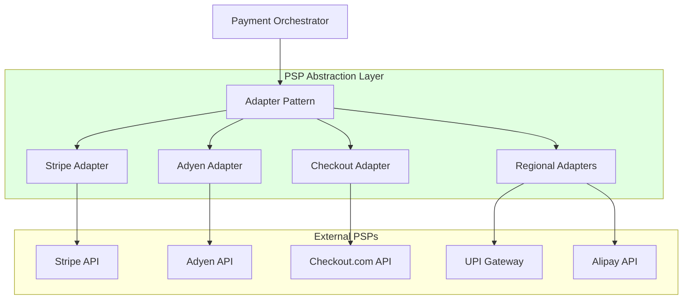

## Multi-PSP Strategy

### Primary PSPs:

- Stripe - North America, Europe (cards, ACH, wallets)  
- Adyen - Global (200+ countries, 250+ payment methods)  
- Checkout.com - Europe, Asia (cards, APMs)  
- Regional PSPs - Local payment methods (UPI, Alipay, iDEAL)

 

### Adapter Pattern Benefits:

- Standardized internal API  
- Easy to add/remove PSPs  
- A/B testing of PSPs  
- Graceful degradation  

 

## Supported Payment Methods

**Cards:** Visa, Mastercard, American Express, Discover, JCB, UnionPay  

**Digital Wallets:** Apple Pay, Google Pay, Samsung Pay, PayPal, Alipay, WeChat Pay  

**Bank Transfers:**  
ACH (US), SEPA (EU), Faster Payments (UK), UPI (India), PIX (Brazil)  

**Buy Now Pay Later:** Klarna, Affirm, Afterpay, Zip  

**Alternative Methods:** SOFORT, iDEAL, Giropay, Bancontact, Multibanco  
