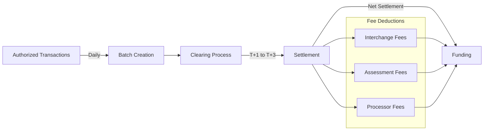
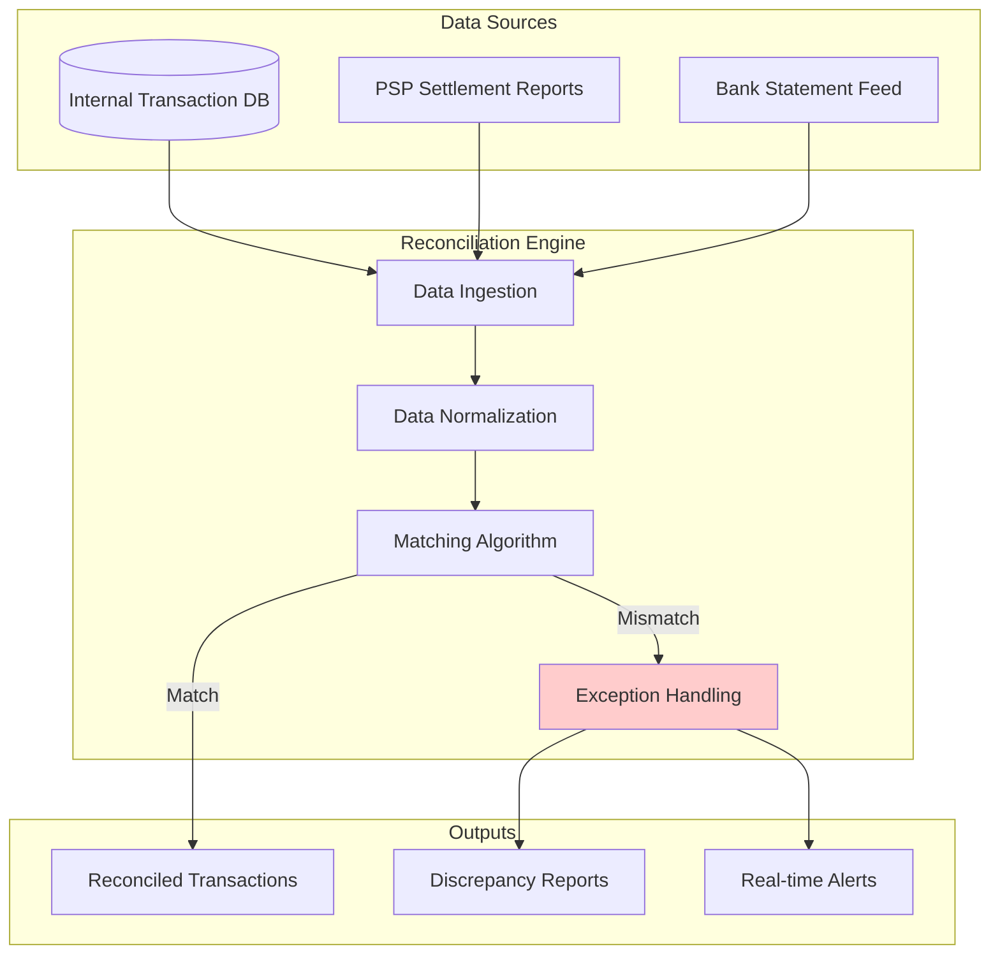
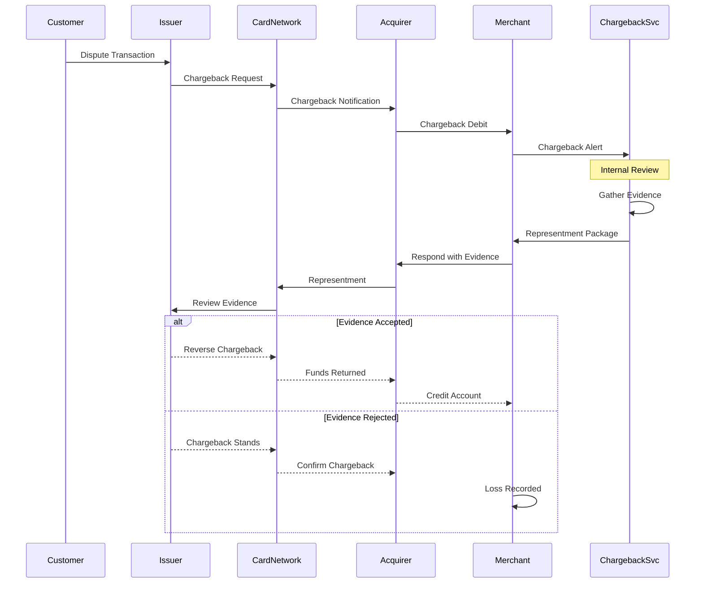

## Clearing Service

### Process

- Batch authorized transactions (typically end-of-day)
- Send batch to PSP/Acquirer
- PSP forwards to Card Network
- Card Network performs clearing
- Issuer confirms amounts

### Batch Schedule

- Real-time batching for high-value (>$10,000)
- Hourly batching for standard transactions
- End-of-day batch for low-value

 

## Settlement Engine
### Settlement Flow

### Settlement Timeframes

- **T+0 (Instant):** Real-time payments, some PSPs (premium service)
- **T+1 (Next day):** Most card transactions
- **T+2 (2 days):** Standard for some acquirers
- **T+3 (3 days):** International transactions

### Net Settlement

- Aggregate all transactions
- Deduct fees (interchange, assessment, processing)
- Transfer net amount to merchant account

 

## Reconciliation Service

### Three-Way Reconciliation

- Internal Records (our transaction database)
- PSP Reports (settlement reports from Stripe, Adyen, etc.)
- Bank Statements (actual deposits)
  

### Matching Rules

- **Exact match:** Amount, date, reference ID
- **Fuzzy match:** Amount ±0.01 (for rounding), date ±1 day
- **Partial match:** Partial payments, chargebacks
- **Manual review:** Complex discrepancies

**Automated Reconciliation Rate Target:** >98%

### Exception Types

- Missing transactions (in PSP but not in DB)
- Amount discrepancies
- Fee calculation errors
- Duplicate settlements
- Chargebacks not recorded

 

## Chargeback Management
### Chargeback Flow

### Chargeback Prevention

- Real-time fraud detection
- 3D Secure authentication
- Clear merchant descriptors
- Proactive refunds
- Customer communication

### Chargeback Alerts

- Verifi/Ethoca integration
- Pre-chargeback notifications
- Automatic refund if alert received
- Reduces chargeback ratio

**Target Chargeback Ratio:** <0.9% (industry threshold 1%)
