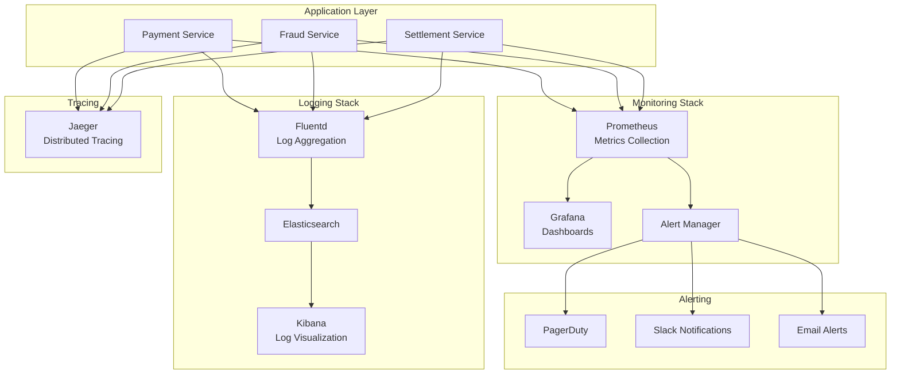

 

## Key Metrics

### Business Metrics

- **Total Payment Volume (TPV)**
- **Authorization Rate (%)**
- **Decline Rate (%)**
- **Fraud Rate (%)**
- **Chargeback Rate (%)**
- **Average Transaction Value (ATV)**
- **Customer Lifetime Value (CLV)**

### Technical Metrics

- **Transactions Per Second (TPS)**
- **API Response Time (p50, p95, p99)**
- **Error Rate (%)**
- **Uptime (%)**
- **Database Query Time**
- **Cache Hit Rate (%)**

 

## SLIs (Service Level Indicators)

- **Availability:** 99.99% uptime  
- **Latency:** p95 < 300ms  
- **Error Rate:** < 0.1%

 

## SLOs (Service Level Objectives)

- **Payment authorization:** 99.95% success rate  
- **Fraud detection:** < 50ms latency  
- **Settlement accuracy:** 99.99%

 

## Alerting Rules

### Critical Alerts (PagerDuty)

- Service down (all instances)
- Database connection pool exhausted
- High error rate (>1% for 5 minutes)
- Fraud detection service down

### Warning Alerts (Slack)

- High latency (p95 > 500ms)
- Cache miss rate > 20%
- Disk usage > 80%

 

## Dashboards

- **Executive Dashboard** – TPV, authorization rates, revenue  
- **Operations Dashboard** – TPS, latency, error rates  
- **Security Dashboard** – Fraud attempts, blocked IPs  
- **Infrastructure Dashboard** – CPU, memory, disk, network
