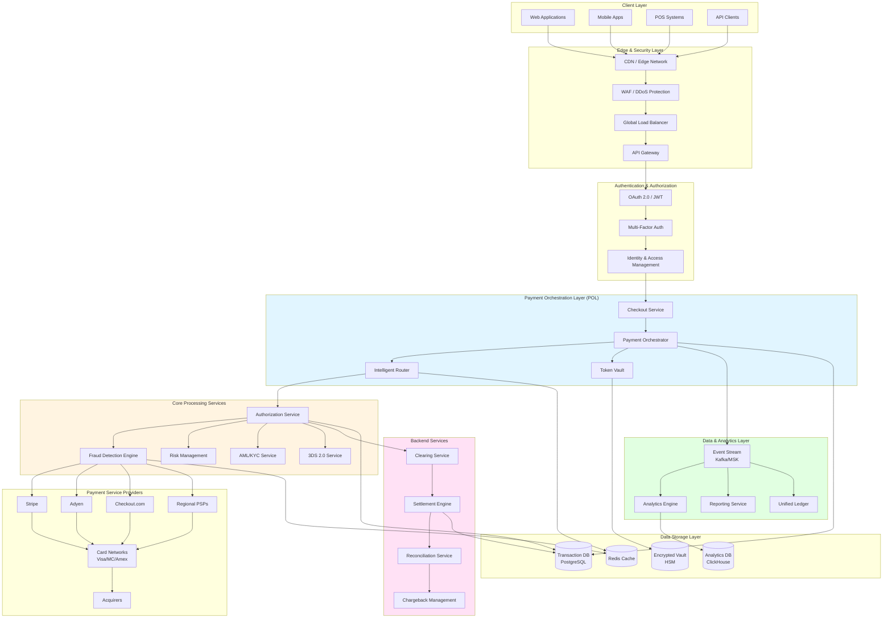

# Payment-Gateway-Architecture : Case-Study

# Key Statistics (2025):

- Global payment orchestration market: $1.41B (projected $14.29B by 2037 at 19.5% CAGR)
- Stripe's total payment volume: $1.4T in 2024
- Digital payment adoption: 84% of retail transactions in major markets
- Average fraud rate: 0.5% (50 fraudulent transactions per 10,000)

 

 

## Core Components

* [Layer 1: Client & Edge Layer](https://github.com/360Appz/Payment-Gateway-Architecture-Case-Study/blob/main/Layer%201%3A%20Client%20%26%20Edge%20Layer.md)
* [Layer 2: Authentication & Authorization](https://github.com/360Appz/Payment-Gateway-Architecture-Case-Study/blob/main/Layer%202%3A%20Authentication%20%26%20Authorization.md)
* [Layer 3: Payment Orchestration Layer (POL)](https://github.com/360Appz/Payment-Gateway-Architecture-Case-Study/blob/main/Layer%203%3A%20Payment%20Orchestration%20Layer%20%28POL%29.md)
* [Layer 4: Core Processing Services](https://github.com/360Appz/Payment-Gateway-Architecture-Case-Study/blob/main/Layer%204%3A%20Core%20Processing%20Services.md)
* [Layer 5: Payment Service Providers (PSP) Integration](https://github.com/360Appz/Payment-Gateway-Architecture-Case-Study/blob/main/Layer%205%3A%20Payment%20Service%20Providers%20%28PSP%29%20Integration.md)
* [Layer 6: Clearing & Settlement](https://github.com/360Appz/Payment-Gateway-Architecture-Case-Study/blob/main/Layer%206%3A%20Clearing%20%26%20Settlement.md)
* [Layer 7: Data & Analytics](https://github.com/360Appz/Payment-Gateway-Architecture-Case-Study/blob/main/Layer%207%3A%20Data%20%26%20Analytics.md)
* [Layer 8: Data Storage Layer](https://github.com/360Appz/Payment-Gateway-Architecture-Case-Study/blob/main/Layer%208%3A%20Data%20Storage%20Layer.md)
* [Layer 9: Observability & Monitoring](https://github.com/360Appz/Payment-Gateway-Architecture-Case-Study/blob/main/Layer%209%3A%20%20Observability%20%26%20Monitoring.md)
* [Layer 10: Observability & Monitoring](https://github.com/360Appz/Payment-Gateway-Architecture-Case-Study/blob/main/Layer%2010%3A%20Observability%20%26%20Monitoring.md)

 

## Extensions

* [Microservices Architecture Details](https://github.com/360Appz/Payment-Gateway-Architecture-Case-Study/blob/main/Microservices%20Architecture%20Details.md)
* [Performance Optimization](https://github.com/360Appz/Payment-Gateway-Architecture-Case-Study/blob/main/Performance%20Optimization.md)
* [Scalability & Load Testing](https://github.com/360Appz/Payment-Gateway-Architecture-Case-Study/blob/main/Scalability%20%26%20Load%20Testing.md)
* [Future Enhancements (2026 Roadmap)](https://github.com/360Appz/Payment-Gateway-Architecture-Case-Study/blob/main/Future%20Enhancements%20%282026%20Roadmap%29.md)

 

## API Documentation

* [API Documentation](https://github.com/360Appz/Payment-Gateway-Architecture-Case-Study/blob/main/API%20Documentation.md)

 

## Appendix

### Glossary

- 3DS (3D Secure) - Authentication protocol for online card transactions
- ACH (Automated Clearing House) - US bank transfer network
- Acquirer - Bank that processes card payments for merchants
- AML (Anti-Money Laundering) - Financial crime prevention
- Authorization - Approval of a payment transaction
- Chargeback - Disputed transaction reversal
- Clearing - Process of reconciling authorized transactions
- Issuer - Bank that issued the payment card
- KYC (Know Your Customer) - Identity verification
- PAN (Primary Account Number) - Full card number
- PCI DSS - Payment Card Industry Data Security Standard
- PSP (Payment Service Provider) - Third-party payment processor
- Settlement - Transfer of funds from issuer to merchant
- Tokenization - Replacing sensitive data with non-sensitive tokens
